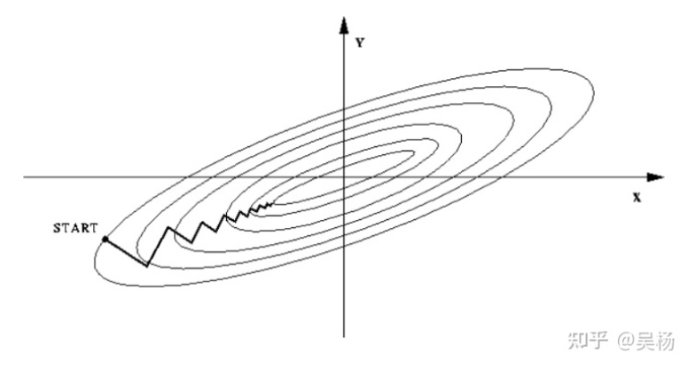
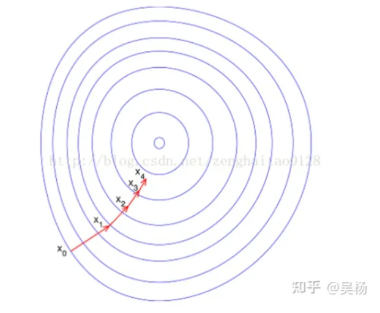

# HW1 线性模型

### 1 线性回归 Linear Regression（50）

#### 1.1 输入数据集 （10）

data1.txt为回归数据集，每一行为一个样本，前两列为特征，最后一列为目标值。按照7:3的比率划分训练集和验证集。

#### 1.2 线性回归（20）

建立线性回归模型，分别使用正规方程和梯度下降法求得参数解。

$$
h_\theta(x)=\theta^Tx
$$

- 正规方程

$$
w=(X^TX)^{-1}X^Ty
$$

- 梯度计算

$$
g=\frac{1}{m}\sum^m_{i=1}(h_\theta(x^{(i)})-y^{(i)})x_j^{(i)}
$$

#### 1.3 可视化（20）

- 使用梯度下降法时请可视化loss曲线
  
- 请可视化验证集上所求回归直线
  

---

### 2 逻辑回归 Logitstic Regression/Percetron（50）

#### 1.1 输入数据集（10）

data2.txt为分类数据集，每一行为一个样本，前两列为特征，最后一列为目标值。按照7:3的比率划分训练集和验证集。

#### 1.2 逻辑回归（20）

建立逻辑回归模型，分别使用梯度下降法求得参数解。可尝试使用L2正则化。
$$
h_\theta(x)=\frac{1}{1+e^{-{\theta}^Tx}}
$$

- 梯度计算
  
  $$
  g=\frac{1}{m}\sum^m_{i=1}(h_\theta(x^{(i)})-y^{(i)})x_j^{(i)}
  $$
  
  

- 梯度计算（L2正则化）
  
  $$
  g_j=\frac{1}{m}\sum^m_{i=1}(h_\theta(x^{(i)})-y^{(i)})x_j^{(i)}+2*\lambda*\theta_j
  $$
  
  

#### 1.3 可视化（20)

- 使用梯度下降法时请可视化loss曲线
  

- 请可视化验证集上所求分类直线
  

### 3 Bonus：分析 （10）

- 对比正规方程和梯度下降法，基于实验结果比较两者之间的优劣。
  
  | 正规方程                         | 梯度下降法                                        |
  | ---------------------------- | -------------------------------------------- |
  | 需要选择学习速率α，运行多次尝试不同的α直到找到合适的α | 不需要选取需要选取学习速率α，只需要运行一次计算即可                   |
  | 需要多次迭代，取决于细节，计算可能较慢          | 不需要进行迭代                                      |
  | 当n很大（上百万）时表现很好，通常很有效         | 对于大多数计算机而言，实现逆矩阵计算的代价是以矩阵维度的三次方O(n^3)增长，计算较慢 |
  | 当n>10000时，选择梯度下降效率更高         | 当n<10000时（几百几千维向量），选择正规方程能更好的求解参数            |

- 基于实验结果，对比没有正则化的情况和L2正则化的逻辑回归模型。
  经过正则化的逻辑回归模型在训练集上loss值上升，在测试集上的loss值降低，有效预防了过拟合，模型泛化能力得到提高。
  

- 分析特征归一化和不做归一化对模型训练的影响。
  归一化的目的就是使得预处理的数据被限定在一定的范围内（比如[0,1]或者[-1,1]），从而消除奇异样本数据导致的不良影响
  如果不进行归一化，那么由于特征向量中不同特征的取值相差较大，会导致目标函数变“扁”。这样在进行梯度下降的时候，梯度的方向就会偏离最小值的方向，走很多弯路，即训练时间过长。
  
  如果进行归一化以后，目标函数会呈现比较“圆”，这样训练速度大大加快，少走很多弯路。
  