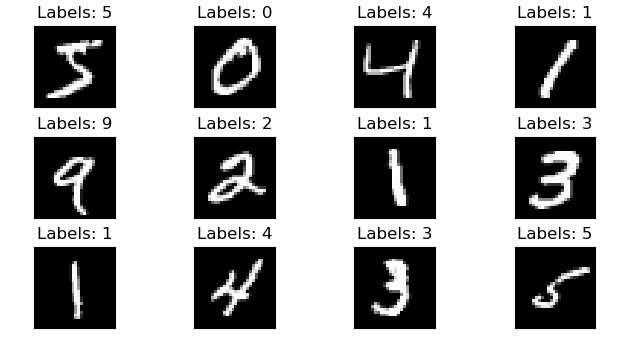
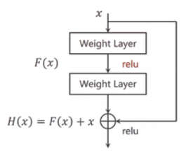
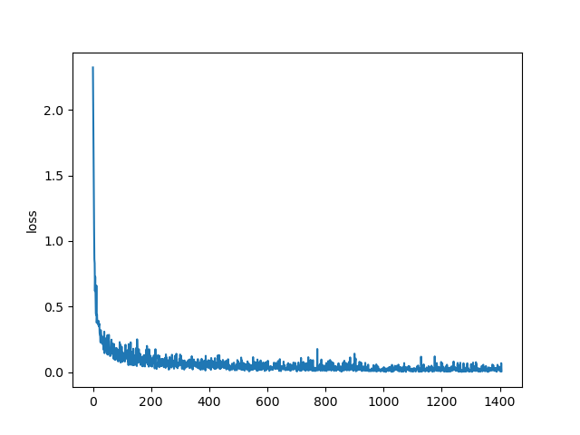
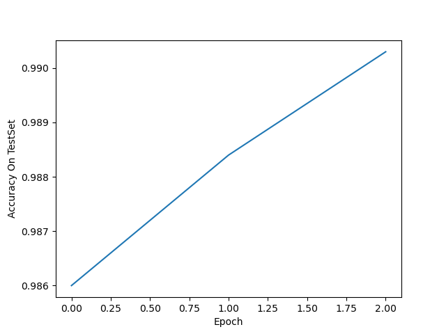

# HW2 MNIST手写体数字识别

### 1 pytorch环境安装（10）

#### 1.1 下载和引入需要的函数库

```python
from bs4 import Tag
from matplotlib.font_manager import stretch_dict
import torch
import numpy as np
from matplotlib import pyplot as plt
from torch.utils.data import DataLoader
from torchvision import transforms
from torchvision import datasets
import torch.nn.functional as F
import torch.nn as nn
```

### 2 MNIST识别（90）

#### 2.1 输入数据集 （10）

MNIST分类数据集，训练数据集包含 60000 个样本，测试数据集包含 10000 样本。每个样本为单通道图片，长宽均为28。(1,28,28)

使用transforms.Compose()对数据集进行归一化处理

使用DataLoader()加载训练集和测试集

```python
#数据归一化处理
transform = transforms.Compose([transforms.ToTensor(), 
                                transforms.Normalize((0.1307,), (0.3081,))])
                                # 其中0.1307是mean均值和0.3081是std标准差


train_dataset = datasets.MNIST(root='./data/mnist', 
                               train=True,transform=transform, download=True)  
                               # 本地没有就加上download=True
test_dataset = datasets.MNIST(root='./data/mnist', 
                              train=False, transform=transform)  
                              # train=True训练集，=False测试集


train_loader = DataLoader(train_dataset, batch_size=batch_size, shuffle=True)
test_loader = DataLoader(test_dataset, batch_size=batch_size, shuffle=False)
```

#### 2.2 数据集可视化（20）

使用matplotlib工具包将数据集可视化。输出十二张手写数据集的图片

```python
fig = plt.figure()
for i in range(12):
    # 将显示界面分割成3*4的网格
    plt.subplot(3, 4, i+1)
    # 调整子图片之间的填充
    plt.tight_layout()
    # 显示图片
    plt.imshow(train_dataset.train_data[i], cmap='gray', interpolation='none')
    # 给图片添加标签
    plt.title("Labels: {}".format(train_dataset.train_labels[i]))
    plt.xticks([])
    plt.yticks([])
plt.show()
```



#### 2.3 模型建立（20）

- 利用卷积层和线性层建立一个深度模型
  ResidualBlock：
  在网络中加入了一个**跳连接**，将input与ouput相加。在做反向传播的时候，可以用于解决梯度消失的问题。
  注意：输出和输入的张量必须**相同**，才能做出跳连接相加的运算
  
  
  
  MY_Net：
  
  - conv 1->32, kernel_size=(5, 5), stride=(1, 1), padding=same
  - conv 32->64, kernel_size=(5, 5), stride=(1, 1), padding=same
  - BN(64)
  - ReLU()
  - ResidualBlock(32)
  - ResidualBlock(64)
  - MaxPool2d(kernel_size=2, stride=2, padding=0)
  - Dropout(p=0.1)
  - Flatten()
  - Linear(12544->1024)
  - ReLU()
  - Dropout(0.2)
  - Linear(1024->10)

- 超参数设置
  
  - batch_size = 128
  
  - learning_rate = 0.01
  
  - momentum = 0.5
  
  - EPOCH = 3

- 优化器和损失函数

```python
criterion = nn.CrossEntropyLoss()  # 交叉熵损失
optimizer = torch.optim.SGD(
    model.parameters(), lr=learning_rate, momentum=momentum)  # lr学习率，momentum冲量
```

- 建立ResidualBlock, MY_Net模型

```python
class ResidualBlock(nn.Module):
    def __init__(self, channels):
        super(ResidualBlock, self).__init__()
        self.channels = channels
        self.conv1 = nn.Conv2d(channels, channels,
                               kernel_size=3, padding=1)
        self.conv2 = nn.Conv2d(channels, channels,
                               kernel_size=3, padding=1)

    def forward(self, x):
        y = F.relu(self.conv1(x))
        y = self.conv2(y)
        return F.relu(x+y)

class MY_Net(nn.Module):
    def __init__(self):
        super(MY_Net, self).__init__()
        self.conv1 = nn.Conv2d(1, 32, kernel_size=5, padding='same')
        self.conv2 = nn.Conv2d(32, 64, kernel_size=5, padding='same')
        self.BN = nn.BatchNorm2d(64)

        self.rblock1 = ResidualBlock(32)
        self.rblock2 = ResidualBlock(64)

        self.MP = nn.MaxPool2d(2, stride=2)

        self.fc = nn.Sequential(nn.Dropout(0.1),
                                nn.Flatten(),
                                nn.Linear(12544,1024),
                                nn.ReLU(),
                                nn.Dropout(0.2),
                                nn.Linear(1024,10),
                                )

    def forward(self, x):
        in_size = x.size(0)  # 取x张量中的第0个维度
        x = F.relu(self.conv1(x))
        x = self.rblock1(x)
        x = F.relu(self.conv2(x))
        x = self.rblock2(x)
        x = F.relu(self.BN(x))
        x= self.MP(x)
        x = self.fc(x)
        return x  # 最后输出的是维度为10的，也就是（对应数学符号的0~9）

model = MY_Net()
```

#### 2.4 模型训练（20）

- 训练3个epoch，观察loss的变化
  
  loss震荡下降的原因：输入的batch_size太小

- 将loss可视化出来，下图为train_loss的可视化图形
  
  

#### 2.5 性能测试（20）

- 将训练好的模型在测试集上进行测试，观察准确率
  
  
