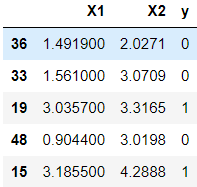
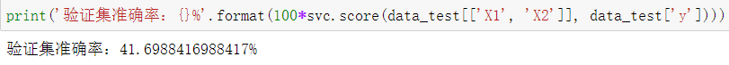

# HW3 支持向量机

### 1 线性SVM（50）

#### 1.1 输入数据集 （10）

data1.mat为分类数据集，每一行为一个样本，前两列为特征，最后一列为目标值。按照7:3的比率划分训练集和验证集。

```python
# 使用loadmat函数加载.mat文件
raw_data = loadmat('data/data1.mat')
# 将前两列特征和最后一列目标值读入data中
data = pd.DataFrame(raw_data['X'], columns=['X1', 'X2'])
data['y'] = raw_data['y']
#将数据集按照7:3的比率划分训练集和验证集。
data_train, data_test = train_test_split(data, test_size=0.3, random_state=42)
```



#### 1.2 模型训练（20）

使用sklearn工具包，调用SVM.linearSVC接口对模型进行训练。

* svm.LinearSVC参数设置
  
  * 错误项的惩罚参数 C = 1
  
  * 损失函数 loss = hinge
  
  * 运行的最大迭代次数 max_iter = 1000
    
    ```python
    # 定义SVM模型
    svc = svm.LinearSVC(C=1, loss='hinge', max_iter=1000)
    # 对模型进行训练
    svc.fit(data_train[['X1', 'X2']], data_train['y'])
    ```

#### 1.3 分析（20）

- 可视化决策边界，并输出验证集准确率
  
  - 使用matplotlib函数对数据集进行可视化，使用svc.predict接口画出决策边界。
    
    其中蓝色原点表示Positive，橙色叉号表示Negative，绿色直线为决策边界
    
    
    
    ```python
    # 决策边界, 使用等高线表示
    x1 = np.arange(0, 4.5, 0.01)
    x2 = np.arange(0, 5, 0.01)
    # 在x，y轴上以0.01为间隔，生成网格点
    x1, x2 = np.mshgrid(x1, x2)
    # 预测每个网格点的类别0/1
    y_pred = np.array([svc.predict(np.vstack((a, b)).T) for (a, b) in zip(x1, x2)])
    # 等高线图，将0/1分界线（决策边界）画出来
    plt.contour(x1, x2, y_pred, colors='g', linewidths=.5)
    ```
  
  - 使用svc.score接口得到验证集准确率
    
    ```python
    print('验证集准确率：{}%'.format(100*svc.score(data_test[['X1', 'X2']], data_test['y'])))
    ```
    
    输出得到验证集准确率：100.0%

- 基于实验，分析软惩罚参数 C 对于决策边界的影响
  
  - 当软惩罚参数C=500时，其决策边界如下图所示。可以观察到，决策边界几乎完美的区分了Positive的数据点和Negative的数据点，但此时模型对于训练集过拟合，泛化性能下降，因此软惩罚参数 C 十分重要，需要同时兼顾模型泛化能力和预测准确率。
  
  - C越大，相当于惩罚松弛变量，希望松弛变量接近0，即对误分类的惩罚增大，趋向于对训练集全分对的情况，这样对训练集测试时准确率很高，但泛化能力弱。
  
  - C值小，对误分类的惩罚减小，允许容错，将他们当成噪声点，泛化能力较强。
    
    

### 2 非线性SVM（50）

#### 2.1 输入数据集（10）

data2.mat为分类数据集，每一行为一个样本，前两列为特征，最后一列为目标值。按照7:3的比率划分训练集和验证集。

```python
# 使用loadmat函数加载.mat文件
raw_data = loadmat('data/data2.mat')
# 将前两列特征和最后一列目标值读入data中
data = pd.DataFrame(raw_data['X'], columns=['X1', 'X2'])
data['y'] = raw_data['y']
#将数据集按照7:3的比率划分训练集和验证集。
data_train, data_test = train_test_split(data, test_size=0.3, random_state=42)
```


#### 2.2 模型训练（10）

- 使用sklearn工具包，调用SVM.SVC接口对模型进行训练，kernel选择rbf。
  
  - svm.LinearSVC参数设置
    
    - 核函数 kernel = 'rbf'
    
    - 错误项的惩罚参数 C = 100
    
    - 核函数参数 gamma = 'auto'
      
      ```python
      # 定义SVM模型
      svc = svm.SVC(kernel='rbf', C=100, gamma=1)
      # 对模型进行训练
      svc.fit(data_train[['X1', 'X2']], data_train['y'])
      ```
      
      

#### 1.3 分析（30)

- 换用不同的kernel，分析不同kernel和不同参数值对于验证集准确率的影响。
  
  - Linear核：主要用于线性可分的情形。参数少，速度快，对于一般数据，分类效果已经很理想了。
  
  - RBF核：主要用于线性不可分的情形。参数多，分类结果非常依赖于参数。有很多人是通过训练数据的交叉验证来寻找合适的参数，不过这个过程比较耗时。
  
  - poly核：多项式核函数可以实现将低维的输入空间映射到高维的特征空间。可解决非线性问题。多项式核函数的参数多，当多项式的阶数d比较高的是，由于学习复杂性也会过高，易出现“过拟合”现象。
  
  - sigmoid：采用Sigmoid函数作为核函数时，支持向量机实现的就是一种多层感知器神经网络。
  1. 核函数 kernel = 'rbf'
     
     错误项的惩罚参数 C = 100
     
     核函数参数 gamma = 10
     
     
  
  2. 核函数 kernel = 'poly'
     
     错误项的惩罚参数 C = 100
     
     核函数参数 gamma = 'auto'
     
     
     
  
  3. 核函数 kernel = 'sigmoid'，错误项的惩罚参数 C = 100，核函数参数 gamma = 'auto'
     

### 3 Bonus（20）

- 对数据集data3进行SVM训练，并试图找到最好的一组超参数，撰写分析报告。

#### 3.1 输入数据集

使用loadmat函数载入数据集，data_train为训练集，data_test为验证集。

```python
raw_data = loadmat('data3.mat')
data_train = pd.DataFrame(raw_data['X'], columns=['X1', 'X2'])
data_train['y'] = raw_data['y']

data_test = pd.DataFrame(raw_data['Xval'], columns=['X1', 'X2'])
data_test['y'] = raw_data['yval']
```

#### 3.2 超参数设置

设置核函数 kernel ，错误项的惩罚参数 C 核函数参数 gamma 多组参数

```python
kernel_values = ['linear', 'poly', 'rbf', 'sigmoid']
C_values = [0.01, 0.1, 0.5, 1, 5, 10, 30, 100]
gamma_values = [0.01 ,0.1, 0.5, 1, 10, 50, 100]
```

#### 3.3 模型训练

训练每组参数，并找到测试集分数最高的那一组参数

```python
for kernel in kernel_values:
    for C in C_values:
        print(C)
        for gamma in gamma_values:
            print(gamma)
            svc = svm.SVC(kernel=kernel, C=C, gamma=gamma)
            svc.fit(X, y)
            score = svc.score(Xval, yval)
            if score > best_score:
                best_score = score
                best_params['kernel'] = kernel
                best_params['C'] = C
                best_params['gamma'] = gamma
```

#### 3.4 可视化

可视化决策边界，并输出验证集准确率和三个最佳的参数


