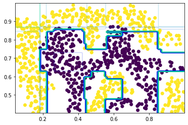
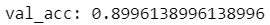
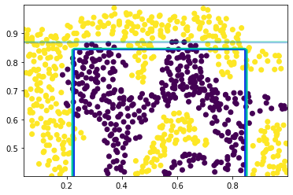
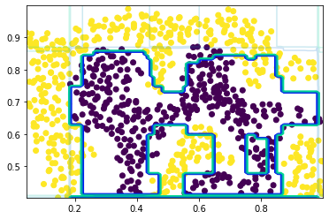
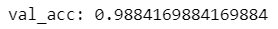
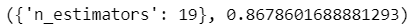
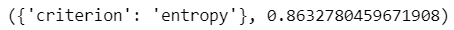
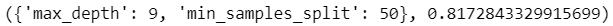
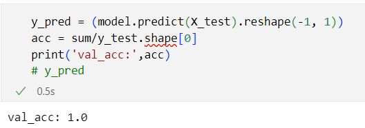
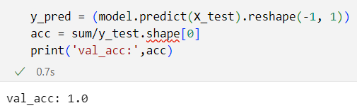

# HW4 集成模型

### 1 adaboost（50）

#### 1.1 输入数据集 （10）

data1.mat为分类数据集，每一行为一个样本，前两列为特征，最后一列为目标值。按照7:3的比率划分训练集和验证集。

```python
# 使用loadmat函数加载.mat文件
raw_data = loadmat('data1.mat')
# 将前两列特征和最后一列目标值读入data中
X=raw_data['X']
y=raw_data['y']
#将数据集按照7:3的比率划分训练集和验证集。
X_train,X_test,y_train,y_test=train_test_split(X,y,random_state=1,train_size=0.7,test_size=0.3)
```

#### 1.2 模型训练（20）

使用sklearn工具包，调用ensemble.AdaBoostClassifier接口对模型进行训练。

* ensemble.AdaBoostClassifier参数设置
  
  * base_estimator： AdaBoostClassifier和AdaBoostRegressor都有该参数，表示弱学习器，原则上可以选择任何一个弱学习器，不过需要支持样本权重。
  
  * n_estimators: 整数型，可选参数，默认为50。最大的弱学习器的个数。一般来说n_estimators太小，容易欠拟合，n_estimators太大，又容易过拟合，一般选择一个适中的数值。默认是50。在实际调参的过程中，我们常常将n_estimators和下面介绍的参数learning_rate一起考虑。
  
  * learning_rate: 浮点型，可选参数，默认为1.0。每个弱学习器的权重缩减系数，取值范围为0到1，对于同样的训练集拟合效果，较小的v意味着我们需要更多的弱学习器的迭代次数。通常我们用步长和迭代最大次数一起来决定算法的拟合效果。所以这两个参数n_estimators和learning_rate要一起调参。一般来说，可以从一个小一点的v开始调参，默认是1。
    
    ```python
    # 定义SVM模型
    model = ensemble.AdaBoostClassifier(base_estimator=None, n_estimators=50, random_state=42)
    # 对模型进行训练
    model.fit(X_train, y_train.ravel())
    ```

#### 1.3 分析（20）

- 可视化决策边界，并输出验证集准确率
  
  
  
  
  
  ```python
  y_pred = (model.predict(X_test).reshape(-1, 1))
  acc = np.sum(y_pred==y_test)/y_test.shape[0]
  print('val_acc:',acc)
  ```
  
  
- 基于实验，分析不同的基分类器和基分类器数量对于模型性能的影响
  * base_estimator：none
  * n_estimators: 5
    
  * 
  * base_estimator：none
  * n_estimators: 100
    
  * 

### 2 随机森林（50）

#### 1.1 输入数据集（10）

data1.mat为分类数据集，每一行为一个样本，前两列为特征，最后一列为目标值。按照7:3的比率划分训练集和验证集。

```python
# 使用loadmat函数加载.mat文件
raw_data = loadmat('data1.mat')
# 将前两列特征和最后一列目标值读入data中
X=raw_data['X']
y=raw_data['y']
#将数据集按照7:3的比率划分训练集和验证集。
X_train,X_test,y_train,y_test=train_test_split(X,y,random_state=1,train_size=0.7,test_size=0.3)
```

#### 1.2 模型训练（10）

使用sklearn工具包，调用ensemble.RandomForestClassifier接口对模型进行训练。

* ensemble.RandomForestClassifier参数设置
  
  * n_estimators：森林中决策树的数量。默认100。
  
  * criterion：分支结点所用的标准，可选“gini”, “entropy”，默认“gini”。
  
  * max_depth：树的最大深度。
  
  * min_samples_split: 拆分内部节点所需的最少样本数，默认是2。

```python
# 定义SVM模型
model = ensemble.RandomForestClassifier(n_estimators=100,
                                        criterion = 'gini', # {“gini”, “entropy”, “log_loss”}
                                        max_depth=None,
                                        min_samples_split = 2)
# 对模型进行训练
model.fit(X_train, y_train.ravel())
```



#### 1.3 分析（30)

- 换用不同的n_estimators、criterion、max_depth、min_samples_split ，分析其对于验证集准确率的影响。
  
  * 首先对n_estimators进行网格搜索
    
    ```python
    param_test1 = {'n_estimators':list(range(1,100))}
    gsearch1 = GridSearchCV(estimator = ensemble.RandomForestClassifier(oob_score=True,random_state=33), 
                          param_grid = param_test1, scoring='roc_auc',cv=5,n_jobs=-1)
    gsearch1.fit(X,y)
    gsearch1.best_params_, gsearch1.best_score_
    ```
    
    当 n_estimators = 19 时得分最高
    
  
  * 对criterion进行网格搜索
    
    ```python
    param_test3 = {'criterion':['gini', 'entropy', 'log_loss']}
    gsearch3 = GridSearchCV(estimator = ensemble.RandomForestClassifier(oob_score=True,random_state=42), 
                          param_grid = param_test3, scoring='roc_auc',cv=5,n_jobs=-1)
    gsearch3.fit(X,y)
    gsearch3.best_params_, gsearch3.best_score_
    ```
    
    当 criterion = 'entropy' 时得分最高
    
  
  * 对决策树最大深度max_depth和内部节点再划分所需最小样本数min_samples_split进行网格搜索
    
    ```python
    param_test2 = {'max_depth':list(range(1,14,2)), 'min_samples_split':list(range(50,201,20))}
    gsearch2 = GridSearchCV(estimator = ensemble.RandomForestClassifier(n_estimators= 70, oob_score=True, random_state=33),
                            param_grid = param_test2, scoring='roc_auc', cv=5,n_jobs=-1)
    gsearch2.fit(X,y)
    gsearch2.best_params_, gsearch2.best_score_
    ```
    
    当 max_depth = 9, min_samples_split = 50 时得分最高
    

### 3 Bonus（20）

#### 3.1 使用Iris数据集分别对adaboost和随机森林进行训练。

Iris也称鸢尾花卉数据集，是一类多重变量分析的数据集。数据集包含150个数据样本，分为3类，每类50个数据，每个数据包含4个属性。可通过花萼长度，花萼宽度，花瓣长度，花瓣宽度4个属性预测鸢尾花卉属于（Setosa，Versicolour，Virginica）三个种类中的哪一类。

**Iris数据集的调用**

```
from sklearn.datasets import load_iris
X, y = load_iris(return_X_y=True)
```

#### 3.1 输入数据集

data1.mat为分类数据集，每一行为一个样本，前两列为特征，最后一列为目标值。按照7:3的比率划分训练集和验证集。

```python
X, y = load_iris(return_X_y=True)
#将数据集按照7:3的比率划分训练集和验证集。
X_train,X_test,y_train,y_test=train_test_split(X,y,random_state=42,train_size=0.7,test_size=0.3
```


#### 3.2 模型训练

* 使用sklearn工具包，调用ensemble.AdaBoostClassifier接口对模型进行训练。
  
  * base_estimator：
  * n_estimators: 100
    
    ```python
    # 定义SVM模型
    model = ensemble.AdaBoostClassifier(base_estimator=None, n_estimators=100, random_state=42)
    # 对模型进行训练
    model.fit(X_train, y_train)
    ```

* 使用sklearn工具包，调用ensemble.RandomForestClassifier接口对模型进行训练。
  
  * n_estimators：100
  * criterion：gini
  * max_depth：None
  * min_samples_split: 2
    
    ```python
    # 定义SVM模型
    model2 = ensemble.RandomForestClassifier(n_estimators=100,
                                            criterion = 'gini', # {“gini”, “entropy”, “log_loss”}
                                            max_depth=None,
                                            min_samples_split = 2)
    # 对模型进行训练
    model2.fit(X_train, y_train)
    ```
    
    #### 3.3 分析
- 输出验证集准确率
  
  
