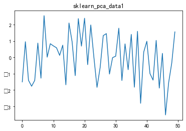

# HW5 降维

### 1 主成分分析（100）

#### 1.1 输入数据集 （30）

data1.mat中，每一行为一个样本，特征维度为2。

data1.mat中，每一行为一个样本，特征维度为2。

data3.mat为人脸特征数据集，每一行为一个样本，特征维度为1024。

```python
# 使用loadmat函数加载.mat文件
raw_data = loadmat('data1.mat')
raw_data2 = loadmat('data2.mat')
raw_data3 = loadmat('data3.mat')
# 将前两列特征和最后一列目标值读入data中
data1 = raw_data['X']
data2 = raw_data2['X']
data3 = raw_data3['X']
```


#### 1.2 手搓PCA（40）

不使用sklearn工具包，只使用numpy对data1，data2，data3进行PCA。
```python
def fun(data, dim):
    # 将数据进行标准化
    # 求平均值
    mean_val = np.mean(data,axis=0)
    meaned_data = data - mean_val
    # 计算协方差矩阵
    cov_mat = np.cov(meaned_data,rowvar=False)
    # 计算特征值和特征向量
    eig_vals,eig_vects = np.linalg.eig(np.mat(cov_mat))
    # 对特征值从大到小排序
    sorted_index = np.argsort(-eig_vals) 
    # 取最大的dim个特征索引
    topn_index = sorted_index[:dim]
    # 最大的n个特征值对应的特征向量
    topn_vects = eig_vects[:,topn_index] 
    # 将数据映射降维
    # 投影到低维空间
    pca_data = meaned_data * topn_vects
    return pca_data
```
#### 1.3 分析（30）

- 可视化data1和data2进行PCA之后的投影直线


- 基于实验，分析data3中根据降维程度的不同，信息损失的差异，并选取最优的降维比率。
  pca.explained_variance_ratio_(返回个个主成分的贡献率)
  我们可以根据观察进行选取维度n的个数，计算其累计贡献率，并画出曲线图
  ```python
  pca = PCA()
  pca.fit(data3)
  # 计算其累计贡献率
  for i in pca.explained_variance_ratio_:
      sum = sum + i
      list.append(sum)
  ```

观察曲线图，可以看出，当特征维度在300左右，累计贡献率在95%左右了，所以选取特征维度降低至300。

#### 1.4 Bonus（10）

- 使用sklearn工具包对data1进行降维，并进行可视化。
  ```python
  # 使用sklean实现
  from sklearn.decomposition import PCA
  # 初始化PCA模型
  pca = PCA(n_components=1)
  # 训练模型
  pca.fit(data1)
  # 获得降维后的数据
  feature1  = pca.fit_transform(data1)
  # 可视化投影直线
  plt.plot(feature1)
  plt.show()
  ```
  
- 用可视化对比分析sklearn实现和numpy实现
  